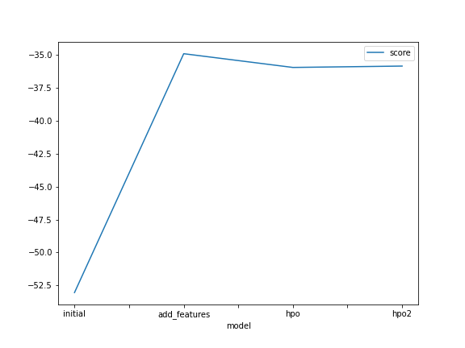
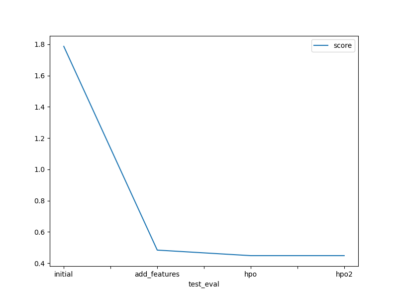

# Report: Predict Bike Sharing Demand with AutoGluon Solution

## Initial Training
### What did you realize when you tried to submit your predictions? What changes were needed to the output of the predictor to submit your results?
In initial training, the while submitting predictions to kaggle it did not accept negative values, so it needed transformation to predictor series.

### What was the top ranked model that performed?
 The top-ranked model was the (hpo2) model named WeightedEnsemble_L3, with a validation RMSE score of -35.836642 and the best Kaggle score of 0.44790 (on test dataset). 

## Exploratory data analysis and feature creation
### What did the exploratory analysis find and how did you add additional features?
EDA performed on dataset provided some valuable insights, such as:
1. Datetime was not identified correctly so needed to change its data type.
 - Datetime was extracted and added as independent columns [day, year, month]
2. Season and weather were integers initially and histogram visualized that these values were indeed representing categoriacal data.
3. atemp, temp, humidity and windspeed showed normal distribution with windspeed being positively skewed.
4. Casual and registered were ignored as they were missing from test dataset.

### How much better did your model preform after adding additional features and why do you think that is?
- The additional featured improved the performance of model by 73% from 1.78 to .48.
- Splitting the datetime column and assigning category aided the model to identify patterns much clearly as integer values are better for model training.

## Hyper parameter tuning
### How much better did your model preform after trying different hyper parameters?
Hypertuning was beneficial as it provided with additional improvement of 8% from .48 to .44. I picked variety of tree models GBM, RF, XT and so on. I increased no of trials and time to see if there is improvement in training provided more attempts and time but results remained same.

### If you were given more time with this dataset, where do you think you would spend more time?
I would spend more time on eda, cause I think there are few features that can still be explored more. Moreover, I would like to try some more hyperparameter changes. 

### Create a table with the models you ran, the hyperparameters modified, and the kaggle score.
|model|hpo1|hpo2|score|
|--|--|--|--|
|initial|prescribed|prescribed|1.78680|
|add_features|prescribed|prescribed|0.48339|
|hpo|GBM, CAT, XT, RF, NN_TORCH (trials: 5)|same models (trials: 10), time_limit: 700|0.44790|

### Create a line plot showing the top model score for the three (or more) training runs during the project.

### Create a line plot showing the top kaggle score for the three (or more) prediction submissions during the project.

## Summary
1. The AutoGluon AutoML framework for Tabular Data was thoroughly studied and incorporated into this bike sharing demand prediction project.
2. We created a base line model for quickly prototyping a solution.
3. Performed EDA on dataset and created new features to improve model accuracy.
4. Hyperparameters also improved additional performance but in second iteration of hyperparamters due to not much change in params except time and trials performance remained same.
